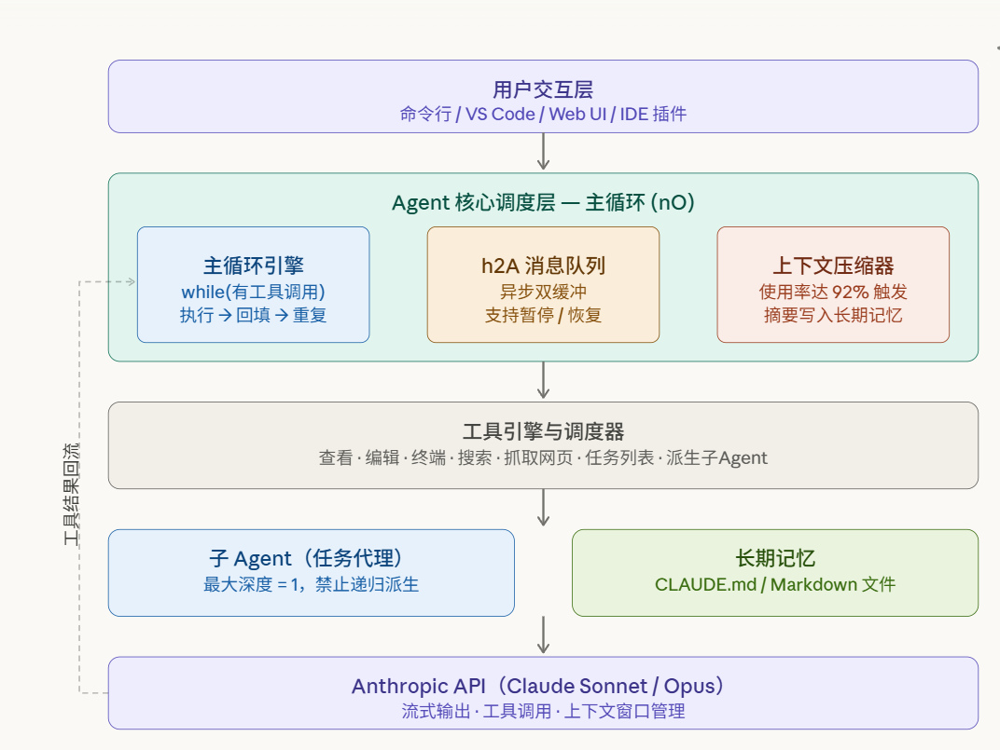

1.claude code 在程序运行中还能在添加对话的原理是什么
这是一个很好的问题！Claude Code 在程序运行中还能添加对话，核心原理是消息队列（Message Queue）机制，结合其**Agentic Loop（代理循环）**架构。下面详细解释：

---
核心原理
1.1 Agentic Loop（代理执行循环）
当你给 Claude Code 一个任务，它会经历三个循环阶段：收集上下文 → 执行操作 → 验证结果。这三个阶段是交织在一起的，Claude 在每一步都会使用工具，并根据上一步的结果决定下一步做什么。
这个循环是持续运行的，不是一次性完成的，所以有机会在中间插入新输入。

---
1.2 消息队列机制（Message Queue）
当你在 Claude Code 执行任务时发送新消息，消息会被静默地放入队列，而不是立即中断当前任务。
你可以一次性排入多条指令，Claude 会智能判断何时处理它们。如果它需要你的反馈，不会自动执行已排队的消息。这是一个相当智能的系统——当它完成某件事时，会在合适的时机开始处理队列中的消息。你可以排入很多任务、去做别的事，很多情况下回来时会发现大量工作已经完成。

---
1.3 两种插入行为：中断 vs 排队
你可以在任何时间点中断来引导 Claude 换个方向、提供额外上下文，或让它尝试不同方案。Claude 是自主运行的，但始终响应你的输入。
具体来说：
暂时无法在飞书文档外展示此内容

---
1.4 会话持久化支撑了这一机制
Claude Code 在你工作时本地保存对话记录，每条消息、每次工具调用和结果都会被存储，这使得回退、恢复和分叉会话成为可能。在 Claude 修改代码之前，它还会对相关文件做快照，以便需要时回滚。
正是因为有完整的会话状态持久化，新消息才能被安全地插入而不会丢失上下文。

---
总结流程图
用户发送消息 ──→ 任务是否正在运行？
                    │
              ┌─────┴──────┐
              是            否
              │             │
         进入消息队列    直接执行
              │
         当前任务完成 / 需要你的反馈时
              │
         自动处理队列中的下一条消息
这个设计让你可以**"边干边想"**，提前排好下一步指令，而不需要一直盯着终端等待。

2.实现原理？
Claude Code 的实现原理相当精妙，它本质上是一个单线程的主循环 Agent 系统，以极简设计驱动复杂能力。下面从几个核心层面来解析：

---
2. 整体技术栈
Claude Code 的技术栈是 TypeScript、React、Ink（终端 UI 框架）、Yoga（布局引擎）和 Bun。90% 的代码由 Claude Code 自己编写。
它以单个 cli.js 文件发布，但这个文件达到 10.5MB，内部打包了 Node.js 应用逻辑、各平台的 ripgrep 二进制文件（用于快速文件搜索），以及 Tree-sitter WASM 模块（用于理解代码结构）。这种打包策略使得零外部依赖——安装包后，运行所需的一切都已包含其中。

---
2. 主循环架构（Master Agent Loop）
这是整个系统最核心的部分：主循环（代号 nO）的核心模式极度简洁：while(tool_call) → 执行工具 → 把结果喂回模型 → 重复。当模型的响应不再包含工具调用时，循环自然终止，等待下一个用户输入。整个系统维护一个单主线程和一个扁平的消息列表，没有多 Agent 群体争抢控制权。

---
3. 实时插入：h2A 异步队列
h2A 异步双缓冲队列的特别之处在于它支持暂停/恢复，并能在任务执行中途无缝接收用户的新指令，而不需要完全重启。当你发现需要追加约束或改变方向时，只需把新指令注入队列，Claude 就会在飞行中调整计划——这正是上一个问题里"运行中还能添加对话"的底层机制。

---
4. 工具系统
工具遵循统一的接口：JSON 工具调用 → 沙箱执行环境 → 返回纯文本结果。具体包括：View（读文件，默认约 2000 行）、Grep（基于 ripgrep 的正则搜索，刻意选择 regex 而非向量数据库）、Edit（外科式 diff 修改）、Write（整文件操作）、Bash（持久 shell 会话，带风险级别分类和危险命令拦截）、WebFetch（仅限用户提及的 URL）、TodoWrite（结构化任务列表）。

---
5. 上下文管理与记忆
上下文压缩器（wU2）在上下文窗口使用率达约 92% 时自动触发，将对话摘要后写入一个 Markdown 文档，作为项目的长期记忆。
设计哲学：保持扁平的消息历史，永远先做简单的事——用正则而非 embedding 搜索，用 Markdown 文件而非数据库存记忆。

---
6. 受控的子 Agent
对于需要并行探索的任务，Claude 可以通过 dispatch_agent 工具（内部称 I2A/Task Agent）派生子 Agent。子 Agent 有深度限制——不能再派生自己的子 Agent，防止递归爆炸。子 Agent 的结果以普通工具输出的形式回流到主循环，维持了整体系统的单线程简洁性。

---
7. 有趣的工程事实
开发团队约十几人，每天完成约 60–100 次内部发布。每位工程师每天平均提交约 5 个 PR，远高于行业的 1–2 个常规。
整体设计哲学用一句话总结：极简的单线程循环 + 纪律严明的工具系统 + 规划机制 = 可控的自主性。竞争对手在追求多 Agent 群体和复杂编排时，Anthropic 选择了一个做一件事做到极致的单线程循环——思考、行动、观察、重复。

3.什么是异步队列？
异步双缓冲（Async Dual-Buffer）是一种经典的并发数据结构模式，核心思想是用两个缓冲区交替工作，让"生产"和"消费"互不阻塞。点击"下一步"可以逐步看完整个过程。下面是核心原理的文字解释：
为什么需要两个缓冲区？
单缓冲区的问题是：生产者写入时，消费者必须等待；消费者读取时，生产者必须停下来。两者共享一块区域，就必须互相等待加锁，效率低。
双缓冲区的解法很优雅：始终保持两个缓冲区，一个供生产者写入，一个供消费者读取，两者同时进行。当消费者处理完毕、生产者也写好了，做一次原子交换（swap）——角色互换，再来一轮。关键在于这次交换几乎是瞬时的，不需要复制数据，只是指针互换。
映射到 Claude Code 的场景：
- 生产者 = 你在任务执行中发送的新消息
- 消费者 = 主循环 nO 正在处理的当前任务
- 交换时机 = 当前任务完成的瞬间
所以你运行中随时发消息，消息进入"写入缓冲区"安静等待，主循环完成任务后原子交换，立刻开始处理你排队的指令——这就是为什么不会丢消息、也不会打断正在执行的工具调用。