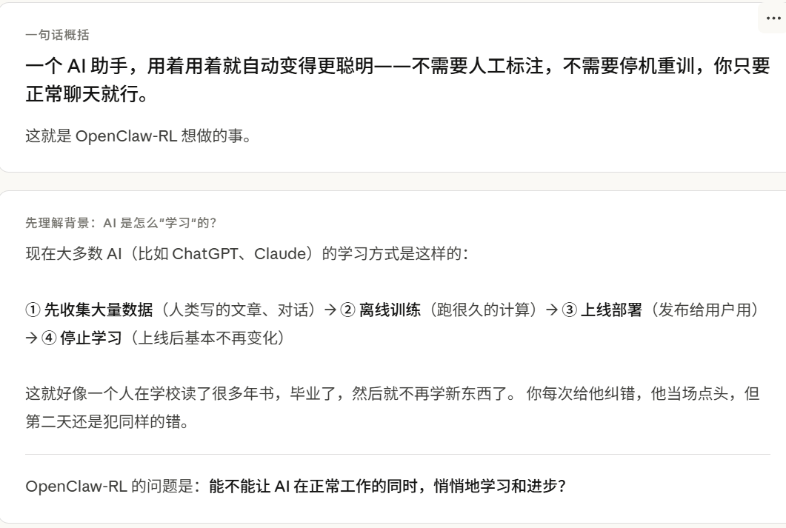
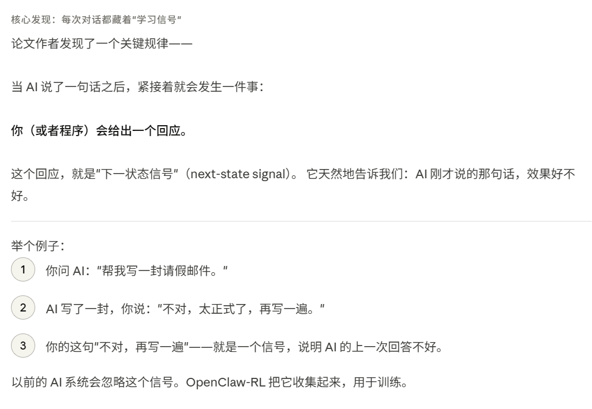
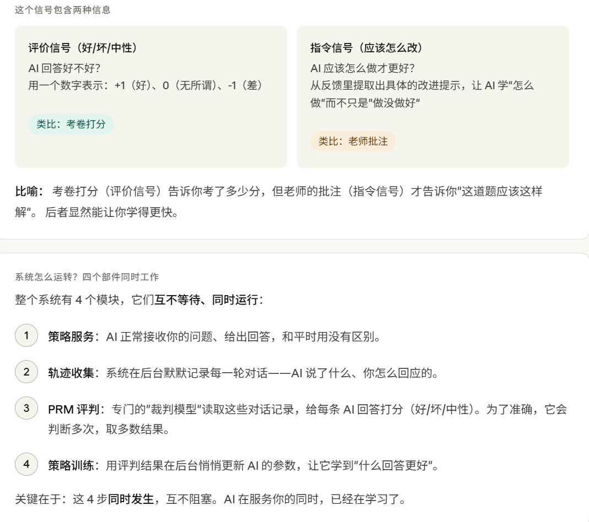
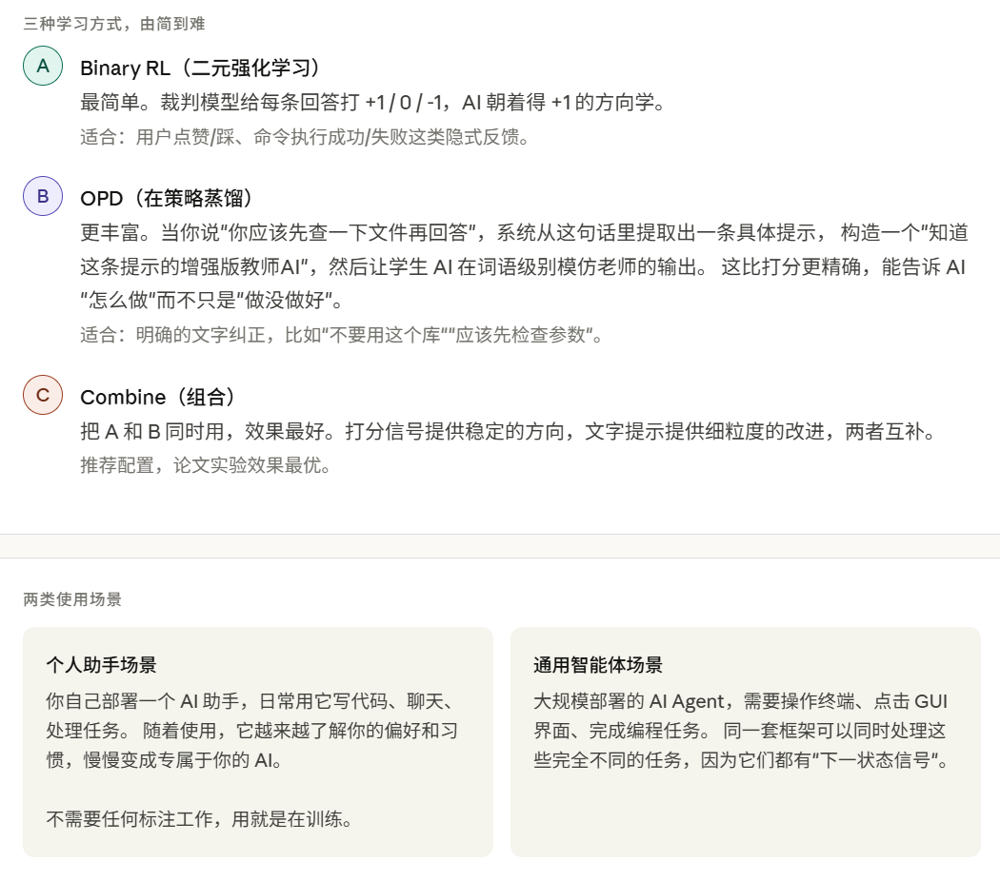
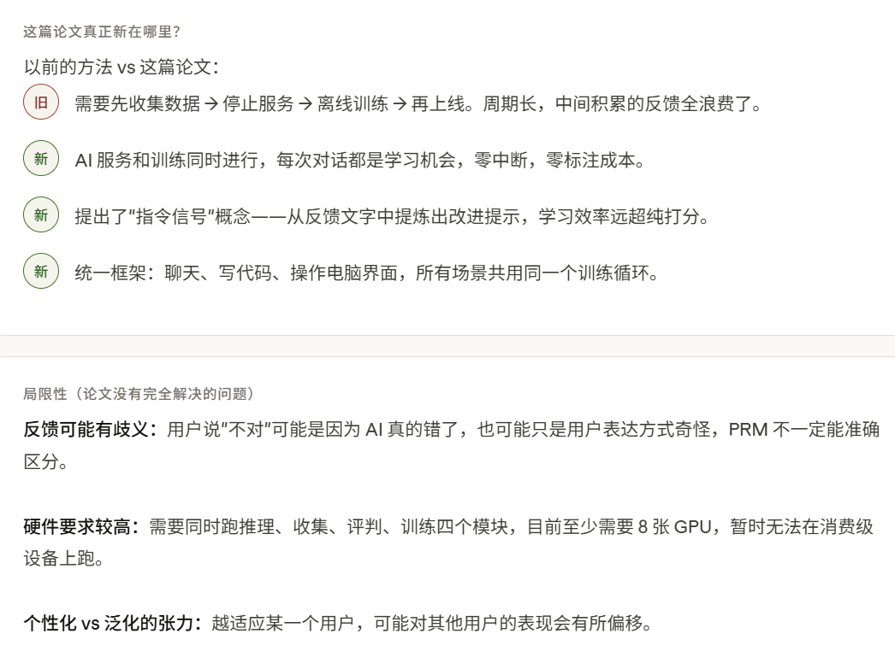

https://arxiv.org/pdf/2603.05344

用户说的是"放飞书文档"，飞书文档是富文本格式，最好输出 Markdown 或者直接给纯文本结构，不需要生成 docx。我直接输出一份结构清晰的 Markdown 汇总即可。

---
OpenDev 终端编程智能体 · 技术要点汇总

---
背景
2024 年末起，AI 编程工具从 IDE 插件（代码补全）转向终端智能体（自主完成任务）。Claude Code、Aider、Goose、OpenCode 相继落地，行业焦点从"更聪明的补全"变为"能自己干活的 Agent"。
OpenDev 发布了目前公开最详细的终端编程智能体技术报告，以下是核心设计思想的整理。

---
一、多模型分工：不同任务交给不同模型
单一模型无法兼顾能力与成本。OpenDev 将系统拆成五种模型角色：
暂时无法在飞书文档外展示此内容
关键设计：把"思考"和"行动"拆成两次独立 API 调用。思考阶段不传任何工具 schema，模型没有工具可用，只能专注推理，从架构层面消除"拿锤子看什么都是钉子"的问题。

---
二、上下文管理：整个系统最难的工程问题
真实开发任务中，工具输出会吃掉 70–80% 的上下文窗口。不处理的话，十几轮对话就会溢出。
五级自适应压缩（ACC），随上下文压力逐步升级手段：
暂时无法在飞书文档外展示此内容
便宜的操作（替换、剪枝）通常已经足够，实测峰值上下文消耗降低约 54%。
工具输出在源头就压小：大文件只留摘要行和路径，需要时再读取，把"上下文问题"转化为"检索问题"。
双重记忆机制：
- 情景记忆：用 LLM 将完整历史压缩成摘要，记录长期目标和关键决策，每 5 条新消息从完整历史重新生成（避免"摘要的摘要"失真）
- 工作记忆：最近几轮对话原文保留，保证行号、报错等精确细节不丢失

---
三、对抗注意力衰减：在对的时机说对的话
对话越长，模型越容易忘记系统提示里的指令。超过 15 次工具调用后，这类问题稳定复现。
解法：事件驱动的系统提醒，监控 8 种异常信号（工具失败未重试、连续只读操作过多、任务未完成就想收尾等），触发时注入一条精准的短提醒，而非在开头堆砌所有指令。
两个细节：
- 提醒用 role: user 注入，而非 role: system——出现在对话末尾，模型更容易响应
- 每种提醒有触发次数上限，防止变成噪音被忽略

---
四、安全设计：让危险操作不可见
核心原则：让危险操作不存在，比让它不可执行更有效。
- 计划阶段直接从工具 schema 中移除写操作，模型不知道有这个能力，自然不会去用
- 五层独立防御机制（系统提示声明 → schema 过滤 → 运行时审批 → 工具内部黑名单 → 外部钩子脚本），任意一层被绕过，其余层仍然生效
- rm -rf /、sudo、fork bomb 等危险命令在工具层硬编码拦截，任何配置都无法覆盖

---
五、容错设计：工具要能容忍"差不多对"
LLM 的输出几乎总是略有偏差（多个空格、缩进不同、转义字符有出入）。
九级渐进匹配链：编辑文件时，从精确匹配开始，依次放宽到忽略尾部空白、模糊锚点匹配、空白归一化、忽略缩进、处理转义……第一个成功的策略立即停止。匹配返回文件中实际的文字，不破坏原始格式。
错误恢复要具体：将工具报错分为 6 类（权限、文件不存在、编辑不匹配、语法错误、限流、超时），每类配恢复模板，直接告知模型"哪里出了什么错、应该怎么修"，而非只返回"请重试"。

---
六、懒加载：按需使用资源
- 工具懒加载：启动时不加载任何外部工具 schema，需要时按关键词搜索注册表，基线上下文开销从 40% 降至 5% 以下
- 技能懒加载：启动时只扫描 YAML 头部建立索引，使用时才加载完整内容
- 所有可增长的资源都设上限：迭代次数、撤销历史（最多 50 条）、并发工具调用（最多 5 个）、提醒触发次数

---
七、子智能体：隔离即安全
- 主智能体与子智能体是同一个类的不同参数实例，避免了类继承带来的菱形问题
- 每个子智能体创建时锁定工具集，代码探索子智能体只有只读工具，写操作在其世界里不存在
- 主智能体在同一次回复中发出多个 spawn_subagent，系统自动并行执行，无需手动管理并发

---
八、持久化与撤销
- 影子 Git 仓库：在用户仓库之外独立维护，每次文件修改自动存快照，撤销时算 diff 恢复，不影响用户自己的版本控制
- 确定性操作走命令处理器：换模型、管理 MCP 服务器等操作以 / 开头直接执行，不经过智能体推理循环，节省 token 也减少随机性

---
核心原则总结
1. 上下文是预算，渐进压缩，大输出存文件系统按需读取
2. 安全靠架构，让危险操作不可见，多层独立防线
3. 提醒要精准、适时、有数，在快出错时注入，不重复
4. 工具要容忍偏差，帮模型补上 gap，报错要具体可操作
5. 能懒加载就懒加载，所有可增长的东西都要有上限
6. 确定性操作与智能体循环分开，各司其职

---
现状与展望
当前 Terminal-Bench 显示前沿模型完成 CLI 任务的通过率不到 65%，LongCLI-Bench 多类别编程任务通过率不到 20%，仍有较大提升空间。
值得关注的方向：动态调整压缩阈值和思考深度、跨项目记忆迁移、用进化策略自动优化上下文配置（已有研究显示可将 SWE-bench 通过率从 70.7% 提升到 89.1%）、以及强化人机协作模式。

----------

方式 A：Binary RL（二元强化学习）
适合反馈类型： 隐式反馈——用户说"再来一遍"、命令执行失败、点踩等
工作流程：
1. AI 给出回答
2. 用户产生下一条消息（这就是"下一状态信号"）
3. PRM 裁判模型读完整段对话，打分：+1（好）、0（中性）、-1（差）
4. 为了防止单次判断出错，打分重复 m 次，取多数票
5. 用这个分数 + GRPO 算法更新模型
GRPO 做了什么：
- 同一问题生成多条回答，算每条的相对优势（自身分 - 组内平均分）
- 用 PPO 截断技巧控制更新幅度，防止模型剧烈抖动
优点： 适用面广，不需要用户说具体话，只要有行为反馈就行 缺点： 信号粗糙，只告诉 AI"这次做得好/不好"，不告诉它"应该怎么改"

---
方式 B：OPD（后见之明引导的在策略蒸馏）
适合反馈类型： 显式反馈——用户说"你应该先查文件再回答"、"不要用这个库"等具体指正
工作流程：
1. AI 给出回答，用户给出具体纠正
2. 裁判模型从用户反馈里提炼出一条改进提示（hint），比如："回答文件查询问题前，应先执行 ls 命令"
3. 如果 m 次提炼结果不一样，取最长、最具体的那个；如果提示太空洞，直接丢弃
4. 把这条提示拼在原问题前面，构造"增强版教师上下文"
5. 让 AI（此时有提示作为线索）重新回答，得到"教师回答"
6. 计算教师回答与原始学生回答在每个词语上的概率差异，作为方向性优势信号
7. 用这个词语级信号更新模型（只计算回答后缀部分的对数概率，节省显存）
为什么叫"蒸馏"： 把"知道额外提示的教师模型"的能力，蒸馏进"不知道提示的学生模型"里
为什么叫"在策略"： 教师和学生都是同一个模型，用自己生成的内容训练自己，不依赖外部数据
优点： 信号质量极高，词语级别的方向指导，学得更精准 缺点： 依赖用户给出具体文字反馈，反馈太模糊时提取不到有效提示

---
方式 C：Combine（组合）
核心思路： Binary RL 和 OPD 信号互补，合并到一个损失函数里同时训练
损失函数：
总损失 = w_rl × Binary RL 损失 + w_opd × OPD 损失
默认 w_rl = 1.0，w_opd = 1.0，可根据反馈质量调整
降级处理： 当某条反馈太模糊、提取不到有效 hint 时，OPD 项自动失效，退化成纯 Binary RL，训练不中断
优点： 整体方向 + 词语细节双重覆盖，论文实验中效果最优 推荐程度： 默认首选配置

---
三种方式对比
	Binary RL	OPD	Combine
反馈类型	隐式行为	显式文字纠正	两种都能用
学习粒度	整条回答，一个数字	每个词语，方向信号	双重覆盖
核心算法	GRPO + PPO 截断	教师-学生蒸馏	两者相加
反馈可用性	高（什么反馈都行）	中（需要具体指正）	高（自动降级）
信号质量	粗糙	精细	最优
推荐场景	反馈以行为为主	反馈以文字为主	通用首选

