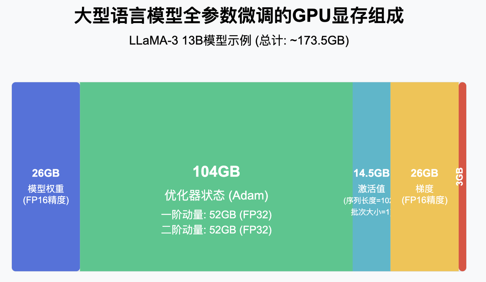
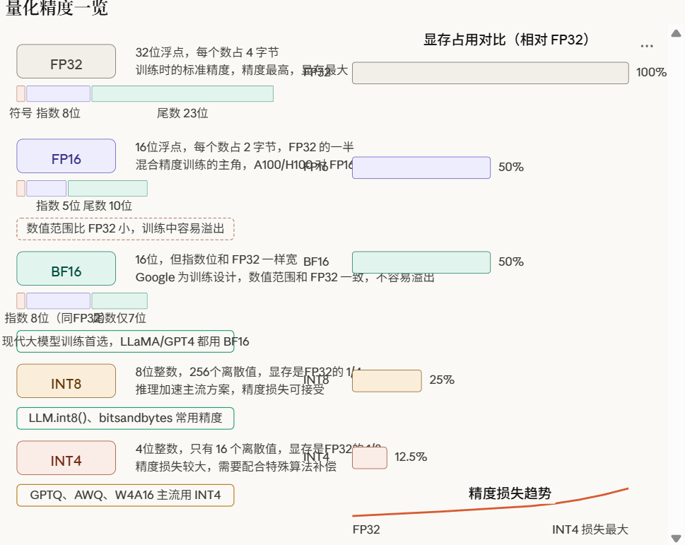

1.显存计算
在进行大模型全参数微调时，显存消耗主要来自四个关键部分：
1. 模型权重存储：这是基础开销，取决于参数量和数据精度。例如FP16/BF16精度下，每个参数占用2字节。
2. 优化器状态：以Adam优化器为例，需要存储：
  - 梯度（与参数同形状）
  - 一阶动量
  - 二阶动量
  这三部分合计通常是模型权重的2-5倍大小(主要取决于优化器、数值精度类型的选取)
3. 中间激活值：即使batch size很小，前向传播和反向传播过程中产生的中间结果也需要显存空间。
4. 框架开销：包括PyTorch等框架运行时的缓存、工作区等额外消耗。
[图片]

让我们以llama3 130亿参数（13B）模型为例，详细计算全参数微调时的显存需求：
1. 模型权重部分：
  假设采用FP16/BF16精度：
  - 参数数量：13,000,000,000（FP16/BF16精度：每个参数2字节）
  - 总大小 = 13B × 2B = 26GB
2. 优化器状态部分​：
  假设使用Adam，采用常规混合精度训练(梯度FP16，动量FP32)
  - 一阶动量：13*4=52GB（FP32，每个参数4字节）
  - 二阶动量：13*4=52GB（FP32）【二阶动量一般FP32，因为值很小，如果量化，精度会受损】
  - 总计 = 52 + 52 =104GB
  如果使用动量混合精度，则一阶动量改用FP16，优化器总显存约26+52=78GB
3. 中间激活值：
  估算公式：
  $$s * b * h * (34 + 5 * a * s / h) * L / 1024 / 1024 / 1024 GB$$
  - 以batchsize=1，序列长度1024为例
  - s：序列长度（sequence length）
  - b：batch size
  - h：隐藏层维度（hidden size）
  - a：attention头数（attention heads）
  - L：层数（number of layers）
- 显存占用大小约为14.5GB
 现在在进行深度学习训练时，可以用 checkpoint 技术来节省内存。它的做法是：在前向计算时只保存一部分关键的中间结果（激活值），等到反向传播时再重新计算这些值，以此来减少内存使用。
主要有两种策略：
- 全量 checkpoint（full checkpointing）：对模型中的所有操作都做 checkpoint，这意味着在反向传播时需要重新执行一次完整的前向计算。虽然这样能把显存使用从比如 60GB 降到 8GB，但代价是计算量大了，大概有 36% 的额外开销。
- 选择性 checkpoint（selective checkpointing）：只对一些计算量小但内存占用大的操作（比如 attention 部分）做 checkpoint。这样可以把重新计算的开销从 36% 降低到 4% 左右，更高效。
4. 梯度：
  梯度：26GB（与参数同形状，FP16）
5. 框架开销等：
     1-3GB
综上：13B模型，模型权重采用FP16，常规混合精度训练(梯度FP16，动量FP32)，batch size为1；且不采用分布式训练和Deepspeed-Zero、Lora等显存优化技术的情况下：
总显存需求 = 26（权重） + 104（优化器） + 14.5（激活） +26（梯度）+ 3（框架） = 173.5GB

---

[图片]

